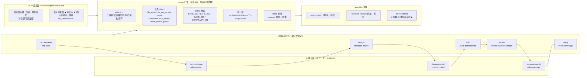

# AI Quality Gate（`qgate`）

把 alibaba/open-code-review 的「**确定性工程 × LLM Agent**」混合架构，与 Anthropic *AI-Native SDLC* 的**分阶段质量门禁**模型，组合成一套**可运行、可验证、完全离线**的 AI 开发质检流程：

- **确定性代码**负责一切能被判定的事情（文件选择、分组、规则匹配、七类 check、策略断言、门禁判定、审计链）；
- **AI 只做语义审查**（`provider.type = llm | external`，以及 OCR 适配层的语义评审面）——本项目**默认全程不调用**，所有命令离线可跑；
- 五个阶段 + **恰好三处人类门禁**，每一阶段的通过与否都是**退出码**，不是散文。

> **本文件中的每一条命令都在当前修订上实测过**，输出与退出码均为实测值（实测环境与冻结指纹见 §7）。
> 发布状态、当前能力边界和未完成项以 [`docs/04-capability-boundaries.md`](docs/04-capability-boundaries.md) 为准；
> `verification-t9/**` 中的报告是历史验证记录，不替代当前命令的结果。

---

## 0. 30 秒速览：实测退出码

| 命令 | 实测退出码 | 实测输出摘要 |
|---|---|---|
| `node --version` | 0 | `v24.19.0` |
| `npm test` | **0** | `tests 115 / pass 115 / fail 0` |
| `npm run test:all` | **0** | `tests 115 / pass 115 / fail 0`（与 `npm test` 是**同一条命令**，见 §1.3） |
| `npm run test:contract` | **0** | `tests 25 / pass 25 / fail 0` |
| `npm run verify` | **0** | demo 门禁：`overall_passed=true`，5/5 gate |
| `npm run release:check` | **0** | 公开发布凭据扫描：`credential_findings=0` |
| `node packages/qgate/bin/qgate.mjs check --config qgate.config.json --json` | **0** | **根门禁**：`overall_passed=true`，5/5 gate |
| `node adapters/opencodereview/tools/run-tests.mjs` | **0** | `tests 145 / pass 145 / fail 0` |

退出码契约：**0 = 通过，1 = 门禁失败，2 = 配置错误，3 = 内部错误**（`qgate contract --json` 的 `exitCodes`）。

---

## 1. 快速开始

### 1.1 前提（实测，无隐藏依赖）

| 前提 | 实测事实 |
|---|---|
| Node.js | 本机实测 **`v24.19.0`**；根 `package.json` 声明 `"engines": { "node": ">=18" }`（**声明值，本项目未实测下限**）；CI 模板 `.github/workflows/quality-gate.yml` 用 `node-version: '20'` |
| 运行时依赖 | **零**：根 `package.json` 无 `dependencies`、无 `devDependencies`（只有 `workspaces: ["packages/*"]`）⇒ **不需要 `npm install`** |
| API Key | **不需要**：根配置 `provider: { "type": "deterministic" }`，全程不读任何密钥 |
| 网络 | **不需要**：所有命令都在本地文件系统上判定；引擎的 `SAFE_003` 断言还专门扫描实现里的网络调用面 |
| go 工具链 | **不需要**：全部入口都是 `node`（本仓库没有任何 `go run/build/test` 命令） |
| 工作目录 | 任意：引擎路径全部从 `import.meta.url` / 配置文件位置推导，不依赖 `PATH` 与 cwd |

### 1.2 跑起来（贴实测输出）

```powershell
cd <仓库根>
node --version
# v24.19.0

npm test
# ℹ tests 115
# ℹ pass 115
# ℹ fail 0

npm run test:contract
# ℹ tests 25
# ℹ pass 25
# ℹ fail 0
```

**demo 门禁（人类可读文本；`--summary` 不是 JSON！）**：

```powershell
node packages/qgate/bin/qgate.mjs check --config demo/qgate.config.json --summary
# exit 0
# stage        | gate                  | required | passed | blockers | checks
# -------------|-----------------------|----------|--------|----------|-------
# requirements | req-spec              | true     | true   | 0        | 3
# design       | interface-frozen      | true     | true   | 0        | 4
# build        | build-deterministic   | true     | true   | 0        | 4
# review       | review-counterexample | true     | true   | 0        | 4
# verify       | verify-coverage       | true     | true   | 0        | 4
```

**根门禁（本项目自身）**：

```powershell
node packages/qgate/bin/qgate.mjs check --config qgate.config.json --json
# exit 0 ；顶层 8 键，无 ok ；overall_passed=true ；5/5 gate
```

**OCR 适配层（离线预览，`ocr` CLI 不存在时降级而不是失败）**：

```powershell
node adapters/opencodereview/bin/ocr-preview.mjs `
  --diff adapters/opencodereview/demo/diff.json `
  --rule adapters/opencodereview/demo/rule.json `
  --json --out "$env:TEMP/ocr.json" --quiet
# exit 0
# mode=preview  degraded=true  llm_called=false
# selectedPaths=14  excludedPaths=9  groups=4
# 敏感材料进入 selected 的条数=0 ；.env.production 出现在 excludedPaths
```

**适配层套件**：

```powershell
node adapters/opencodereview/tools/run-tests.mjs
# exit 0 ；tests 145 / pass 145 / fail 0
```

### 1.3 `npm test` 与 `npm run test:all` 是同一条命令

根 `package.json` 里这两条脚本的字符串**完全相同**：
`node --test --experimental-test-isolation=none "packages/qgate/test/*.test.mjs"`。
保留两个名字只是历史原因（子包与根各有一条入口），**不存在第二套测试**。

> 沙箱提示（本项目多轮实测记录，见 t15/t33/t64 的回报）：Node 测试运行器的**默认 per-file 隔离**
> 与「带管道的子进程 stdio」在受限沙箱里会 `spawn EPERM`；上面两条脚本已固定
> `--experimental-test-isolation=none`，因此 `npm test` 可直接跑通（本文档的 115/115 即实测）。
> 需要采集子进程输出时，用**文件描述符重定向**而不是管道。

### 1.4 五个输出面陷阱（写错极易误导读者）

| # | 陷阱 | 实测事实 |
|---|---|---|
| 1 | **`--summary` 不是 JSON** | `--summary` 输出**人类可读表格**；结构化字段**只出现在 `--summary --out <file>` 的包络里**（契约 §5.2.1）。包络实测键：`overall_passed, gates, not_run_gates, run_id, provider, approvals_missing`（6 键） |
| 2 | **`--stage` 会省略未运行的 gate** | `check --stage design --summary` 实测只输出 `requirements` + `design` 两行；未运行的 gate **不写 `passed:false`**，它们只出现在包络的 `not_run_gates` 里（本次实测 `not_run_gates=[]`，因为跑的是全量） |
| 3 | **`check` 的任何成功输出面都没有 `ok`** | `check --json` 实测顶层**恰 8 键**：`version, run_id, started_at, finished_at, duration_ms, overall_passed, provider, gates`——**判据读 `overall_passed`**，不要找 `ok` |
| 4 | **失败时错误文档恰 `{ok, error}`** | 非法配置实测输出 `{"ok":false,"error":{...}}`，`error.code = CONFIG_INVALID`（见 §4.3） |
| 5 | **需求 id 位数不同** | 根需求 `REQ-QUALITY-GATE-001 … 016`（三位，共 16 条）；demo 需求 **`REQ-DEMO-001 … 006`（三位，共 6 条）** |

另外实测（易与 `check` 混淆）：`preview --json` 顶层**恰 8 键**：`ok, degraded, root, selection, groups, ruleMatch, rules, invariants`
（demo 实测 `selection.included=13`、`selection.excluded=64`、`groups=2`）。

---

## 2. 架构



**确定性 vs 依赖 AI**：

| 面 | 属于 | 说明 |
|---|---|---|
| 文件选择 / 分组 / 规则匹配 / 七类 check / policy 断言 / 门禁判定 / 审计链 / trace 矩阵 | **确定性代码** | 同输入必同输出；本 README 引用的所有退出码都来自这一面 |
| `provider.type=llm`、`provider.type=external` | **依赖 AI / 外部系统** | 本项目**默认不启用**；本机只验证了 `degraded` 降级路径 |
| OCR 适配层的语义评审 | **依赖 AI** | `ocr` CLI 是可选外部工具；缺失时降级（实测 `degraded=true`、`llm_called=false`），**降级不是“没有发现问题”** |
| 三处人类门禁签字 | **人** | 以**自报 JSON** 审批记录的存在性 + 角色匹配判定（§9.1；**无签名、无身份认证**，见 §5.4-3） |

**文件地图**：`packages/qgate/**` 引擎 + CLI（`packages/qgate/bin/qgate.mjs`）；`adapters/opencodereview/**` OCR 适配层与 CI 复用模板；`schemas/*.schema.json` 四份冻结 schema；`docs/**` 需求、契约、五阶段手册与统一能力边界台账（`docs/04-capability-boundaries.md`）；`.github/workflows/quality-gate.yml` CI；`demo/**` 可运行的迷你示例；`verification-t9/**` 独立验证方的报告与工具（**不是**产品代码）。

---

## 3. 端到端演练

### 3.1 五阶段依次通过（`--stage` 是**累积**的：跑到该阶段为止）

```powershell
node packages/qgate/bin/qgate.mjs check --config demo/qgate.config.json --stage requirements --summary
node packages/qgate/bin/qgate.mjs check --config demo/qgate.config.json --stage design       --summary
node packages/qgate/bin/qgate.mjs check --config demo/qgate.config.json --stage build        --summary
node packages/qgate/bin/qgate.mjs check --config demo/qgate.config.json --stage review       --summary
node packages/qgate/bin/qgate.mjs check --config demo/qgate.config.json --stage verify       --summary
# requirements → exit 0（1 个 gate：req-spec）
# design       → exit 0（2 个 gate：req-spec + interface-frozen）
# build        → exit 0（3 个 gate：… + build-deterministic）
# review       → exit 0（4 个 gate：… + review-counterexample）
# verify       → exit 0（5 个 gate，= 全量）
```

三处人类门禁在 demo 里都由**真实存在的审批制品**满足：全量 `--summary --out` 实测 `approvals_missing=0`。

### 3.2 反向用例①：必需制品缺失 ⇒ **退出码 1**

在仓库外的副本里删掉 `docs/00-requirements.md` 后跑根门禁：

```text
exit=1  overall_passed=false
失败 check：req-spec/req-doc-exists, req-spec/req-ids-present
blocker：{"checkId":"req-doc-exists","severity":"high",
          "message":"FILE_MISSING: docs/00-requirements.md matched 0 file(s), minCount=1"}
```

⇒ 门禁**红**，且 blocker **精确指向**被删的那个文件（不是泛化报错）。

### 3.3 反向用例②：非法配置 ⇒ **退出码 2**，输出恰 `{ok, error}`

```powershell
node packages/qgate/bin/qgate.mjs check --config packages/qgate/examples/invalid/unknown-check-type.json --json
# exit 2
# 顶层键 = [ok, error]   ok=false   error.code=CONFIG_INVALID
```

`packages/qgate/examples/invalid/*.json` 共 **6 个**反向夹具（未知 check 类型 / 未知 stage / 重复 check id / 空 gates / 缺 version / 非法 provider 类型）；根配置里的 `negative-fixtures` check 断言这 6 个文件都存在（`minCount=6`），另有一条 `command` check（`invalid-must-fail`）在**每次跑门禁时**把其中「未知 check 类型」这个夹具再跑一遍，要求它**必须**以退出码 2 失败（防止非法配置被静默接受）。

### 3.4 反向用例③：账本索引与证据目录不一致 ⇒ **退出码 3 `EVIDENCE_UNRESOLVED`**

在副本里删掉 `ledger-index.json` 列出的某一条账本后跑根门禁：

```text
exit=3  error.code=EVIDENCE_UNRESOLVED
message=the evidence ledger chain failed verification (1 problem(s))
```

⇒ 审计链**拒绝判定**（而不是静默跳过或按旧账本判定）。

---

## 4. CI 三段式（`verify` job）与四情形矩阵

`.github/workflows/quality-gate.yml` 的 `verify` job 是**三段式**（本地等价复现见该文件头部注释）：

```text
① node packages/qgate/bin/qgate.mjs check --config qgate.config.json --json || true   # 预热：写入完整账本
② node packages/qgate/bin/qgate.mjs trace --config qgate.config.json --write          # 账本已完整 ⇒ 生成 trace
③ node packages/qgate/bin/qgate.mjs check --config qgate.config.json --json           # 权威判定（无 || true）
```

### 4.1 四情形矩阵（在**仓库外的副本**里重放，避免污染本仓库审计链）

**A：交付树全新克隆（证据 + trace 已提交且一致）**

| 步骤 | 实测退出码 |
|---|---|
| ① 预热 `check` | 0 |
| ② `trace --write` | 0 |
| ③ 权威 `check` | **0** ⇒ `overall_passed=true`，5/5 |

⇒ 此时 `|| true` **什么也没吞**，三段式是**防御性**的。

**B：尚无证据的检出（`verification/evidence/**` 与 trace 均不存在）**

| 步骤 | 实测退出码 | 实测证据 |
|---|---|---|
| ① 预热 `check` | **1** | `TRACE_GAP: trace matrix is missing or not parseable JSON`；**同一步写满了账本**（`ledger-index.json` 已生成） |
| ② `trace --write` | 0 | 写出 `covered=16/16` |
| ③ 权威 `check` | **0** | `overall_passed=true` |

**C：顺序颠倒（先 `trace` 再 `check`）**

| 步骤 | 实测退出码 | 实测证据 |
|---|---|---|
| ① `trace --write`（此时无账本） | 0 | 写出**陈旧矩阵** `covered=0/16` |
| ② `check` | **1** | `TRACE_GAP: coverage basis missing / not evaluated: testIdSource=...` |

**D：陈旧 trace + 完整账本**

| 步骤 | 实测退出码 | 实测证据 |
|---|---|---|
| ① `check` | **1** | `TRACE_GAP: coverage basis missing / not evaluated: testIdSource=...` |
| ② `trace --write` | 0 | 修复为 `covered=16/16` |
| ③ `check` | **0** | `overall_passed=true` |

**顺序不可颠倒的成因**：`trace --write` 的 `covered` 判定**依赖 `ledger-index`**。第 1 步的意义就是先把 16 个 testId 写进账本；若颠倒，第 1 步只能写出 `covered=false` 的矩阵，而第 3 步的 `check` 会用**现场账本**算出 `covered=true`，两者不一致 ⇒ `TRACE_GAP` 判失败。引擎**刻意不在 `check` 里自动刷新 trace**，以保留「改了需求却没刷新 trace」这一审计能力（`docs/01-architecture.md` 的 coverage-basis fail-closed 规则；`packages/qgate/gates/README.md`）。

> 预热必须用**完整流水线**（不带 `--stage`）：CI 注释记录实测反例 —— `--stage review` 只写满 15/16 个 testId、`--stage build` 只写满 12/16。

### 4.2 基线新鲜度与干净克隆

`baseline-freshness` 会把适配层套件的结果指针绑定到当前产品树指纹，并在 `--deep` 模式下重新执行记录命令核对计数。它因此是发布约束：任何实现、测试、配置或文档变更后，都必须在最终提交上重录基线，不能沿用旧指针。

全新克隆的 verify job 按固定三段式运行，顺序不可颠倒：

```powershell
node packages/qgate/bin/qgate.mjs check --config qgate.config.json --json   # 预热，可能因 trace 缺失退出 1
node packages/qgate/bin/qgate.mjs trace --config qgate.config.json --write
node packages/qgate/bin/qgate.mjs check --config qgate.config.json --json   # 权威判定
```

本轮已在仓库外的干净克隆中验证：预热写入完整账本，`trace --write` 得到 `covered=16/16`，随后根门禁只剩“基线尚未针对该最终提交重录”这一预期发布准备项。发布前重录后，干净克隆和仓库根都必须通过 `baseline-freshness`。

---

## 5. 能力边界（三类清单）

### 5.1 已实现（确定性、离线，全部有实测退出码）

- **引擎 + CLI**：五阶段门禁、**七类 check**（`file_exists, file_not_exists, regex, command, json_assert, trace_matrix, policy`）、六个命令（`check / contract / trace / preview / report / explain`）、四份冻结 schema（config / run-result / evidence-ledger / trace-matrix）。
- **三处人类门禁**（`req-to-design`/product、`design-to-build`/architect、`review-to-verify`/reviewer），判定 = 审批制品**存在性 + 角色匹配**（§9.1）。
- **安全断言**：`SAFE_001`（密钥路径永不入选）、`SAFE_002`（最宽 include 下密钥路径也不得被重新纳入）、`SAFE_003`（实现里不得有网络调用面）、`CONTRACT_001`——**引擎侧与适配层侧各有一套**。
- **硬链接别名身份链**（t46/t53）：引擎 `ino:` 为主 + `sha:` **精确**兜底；适配层 inode 为主 + **内容形态启发式**兜底。
- **大小写不敏感的安全规则**（t53）、**注释跳过**（含**未闭合 `/*`** 与 **`://`** 两条历史盲点，已 fail-closed，t46）、**coverage-basis fail-closed**（t39）、**账本链校验**（逐条复算 sha256 + 索引一致性 ⇒ `EVIDENCE_UNRESOLVED`）。
- **CI 模板**：`.github/workflows/quality-gate.yml`（5 个 job 与阶段 1:1，含三段式 verify 与人类门禁制品校验）、可复用模板 `adapters/opencodereview/ci/github-actions.yml`。
- **OCR 适配层**：确定性选择/分组/规则匹配（与引擎同源口径）、`ocr` 缺失时**降级**（`llm_called=false`）、离线预览可供 CI 断言（实测 `selectedPaths=14`、`secretsInSelected=0`）。

### 5.2 仅设计 / 未实现（**不得**当成已具备）

- `adapters/opencodereview/src/reflection.mjs` **未接入任何 CLI 路径**（只在测试里被引用）。
- `--delegation` 无实现；行号 re-tracking 无实现。
- 无 UI / Dashboard；无多 CI 平台适配（GitLab / Jenkins / Azure 属**非目标**，`docs/00-requirements.md` §5）；无自动豁免机制；无跨仓规模化性能验证。
- `verification/end-to-end.json` 与 `verification/ci-parity.json` **实测仍不存在**（`docs/01-architecture.md` §8.3.1 的 GAP-9 仍开放）——本 README **不**声称它们存在。

### 5.3 需真实 LLM 或外部系统（不属于离线保证）

- `provider.type = llm | external` 的真实调用仍依赖用户自己的 provider 配置；模型语义结果不属于字节级确定性保证。
- 真实 `ocr` CLI 已在开发环境通过外部 runner 联调，但它不是仓库运行时依赖，公共 clone 不应假设用户已安装或配置它。
- GitHub Actions **真跑**（本机无 runner、无网络；`verification-t9/report-v8.json` 的断言 10 因此标 **blocked**）。
- GitHub Actions 的真实 runner 行为仍需在 GitHub 仓库创建后用一次真实 workflow run 验证。
- **符号链接**绕过（本机无创建权限）；**大小写敏感的文件系统**（`caseSensitiveFilesystemAvailable:false`，只能用受控严格大小写模拟）。

### 5.4 必须一并写明的诚实边界（每条有出处）

1. **证据链抗篡改 ≠ 抗整链伪造**：审计链能证明「账本被改动过」，但**能写 `verification/evidence/**` 的一方就能铸造覆盖率依据**；外部锚点三选项**均未采用**（§5.3.2 信任模型）。
2. **`covered=true` 只证明「承载该 testId 的 check 被执行」**，**不代表根侧测试存在**：索引与账本 id 同源于引擎内置 `checkTestIds`，属**夹具自洽而非独立覆盖** ⇒ **不得**据此宣称「根侧覆盖闭环」（§8.3.1 GAP-9.b）。
3. **人类门禁签字是自报 JSON**：`approvedBy/approvedAt` **无签名、无身份认证**；CI 里的审批步骤是**报告而非门禁**。
4. **`SAFE_001/003` 的检测边界**（§8.3.2）：三类扫描面排除（散文 / 证据 / 夹具）＋ `expectedFiles` 可**逐字反向纳入**（即：显式声明可以放宽扫描面）＋ 注释跳过与两条 fail-closed 修复 ＋ 硬链接身份链覆盖范围 ＋ **两侧兜底信号性质不同**（引擎 `sha` 精确 vs 适配层内容形态启发式）。
5. **平台相关**：`scanRoots` 的大小写解析**依赖文件系统语义**（Windows 不敏感 / Linux 敏感），且**空扫守卫是聚合而非逐根**（`packages/qgate/gates/README.md` Boundary 6；`docs/01-architecture.md` §6.2.3 GAP-7）。
6. **t63/F19 结论（选择面不含取证区）**：根配置没有自己的 `selection`，引擎内置排除表已把 `verification`、`verification-t9` 两棵审计树与 `.qgate/reports|out` 运行时产物排除在扫描面之外 ⇒ `SAFE_002` 的扫描集**不依赖任何人的取证产物**：
   - 同一修订连续两次运行的**规范化 RunResult 哈希一致**（实测 `f02ee920fdfb5662`，含在 `verification-t9/` 新写 3 个文件后仍一致）；
   - 对照实验（只回退该排除表）：同树写入 3 个取证文件后哈希即变化 ⇒ 归因确证；
   - 安全面**未放宽**：`SAFE_002` 的 `secretPathsExcluded` 17→17、`passed=true`；选择集 `selected` 660→143（少掉的都是审计树与运行时产物）。

---

## 6. 一键验证

### 6.1 `npm run verify` 做什么（口径澄清）

`npm run verify` = `node packages/qgate/bin/qgate.mjs check --config demo/qgate.config.json --json`
⇒ 它跑的是 **demo 门禁**（`demo/mini-service` 这个示例仓库），**不是**「验证整个项目」。
实测：**exit 0**，`overall_passed=true`，5/5 gate，`provider={type:"deterministic",degraded:false,detail:"offline-fixture"}`。

要跑**本项目自身**的门禁，用根配置：

```powershell
node packages/qgate/bin/qgate.mjs check --config qgate.config.json --json      # exit 0，5/5 gate
```

### 6.2 项目自身的验证结论（引用，不自述）

历史第三方验证方（verifier）的结论在 **`verification-t9/report-v8.json`**；它只用于追溯，不作为当前 release 的唯一依据：

| 字段 | 实测值 |
|---|---|
| `summary` | `{"pass":57,"fail":0,"blocked":1,"total":58}` |
| `release_recommendation.verdict` | `可放行（release-ready）` |
| `release_recommendation.blocking_conditions_if_any` | `none` |
| `tree_fingerprint` / `tree_fingerprint_file_count` | `74a28c906b73…` / 152 |
| 唯一 blocked | 断言 `10`（真实 GitHub Actions 运行 / 真正干净的 clone 等**不可离线验证**项，逐项给出原因） |

**不要把 57/0/1 自行汇总成「当前全部通过」**，也不要把它当作当前树指纹：report-v8 测的是更早的修订。当前 release 应以本 README 的命令、根门禁和 `docs/04-capability-boundaries.md` 为准。

---

## 7. 冻结修订与实测环境

### 7.1 本文件所描述的修订（三次采样一致）

```powershell
node verification-t9/tools/tree-fingerprint.mjs --json
# fingerprint = 57254035bca557102e1825a7a706f72014287c0714dceb0b2935a47a64f7785b
# files       = 160
# newest      = package.json  (2026-09-19T18:26:40.386Z)
```

- 指纹算法：对 `packages/qgate, adapters/opencodereview, schemas, docs, .github, demo/mini-service, demo/qgate.config.json, package.json, qgate.config.json` 逐文件 sha256，按路径排序拼成清单后再取 sha256（**不含 mtime**）。
- **`verification/**` 与 `verification-t9/**` 不在指纹范围内**，因此验证方写证据、或读者创建根 `README.md`，**都不会**让指纹变化。
- 实测：**三次采样指纹完全相同**（落笔前两次间隔 ≥ 5 分钟、其间跑完本文档的全部命令；落笔后再次复核），即「本文件描述的就是这一修订」。

### 7.2 基线与「过期即红灯」

根门禁里有一条 `command` check **`baseline-freshness`**（`verify-coverage` 门禁）：

```powershell
node verification-t9/tools/baseline-freshness.mjs --deep --quiet
# exit 0  ⇒  BASELINE-FRESHNESS current=57254035bca5 files=6 fresh=1 superseded=5 stale=0 tampered=0 count_drift=0
```

语义（工具头部 `Exit:` 块 + `packages/qgate/gates/README.md` Boundary 7）：**0 = 所有未作废指针 FRESH（`--deep` 下计数还能复现），1 = 至少一个 STALE / COUNT-DRIFT，2 = 至少一个 TAMPERED（payload 哈希不符，即被人手改过），3 = 一个指针文件都没找到**；工具或指针**缺失即失败**（fail-closed，不跳过）。调用**只读**：该工具源码只做读取（无 `writeFileSync / mkdirSync / rmSync` 等写调用），t63 期间实测 `verification-t9` 条目数 568→568→568 —— 注意该目录同时被**独立验证方的取证流程**写入（`artifacts-v9/**` 等），所以条目数会随其进度变化，那些写入不属于产品修订、也不进入任何指纹。

**本条 check 是团队约束，不是个人观察**：任何让产品面发生变化的写入（实现、测试、配置）都会让指纹变化 ⇒ 必须由验证方**重录**基线指针（同一 cwd 内），否则**所有人**看到的门禁都是红的。重录内容 = `# tree_fingerprint` + `# tree_fingerprint_files` + `# expected: testFiles/tests/pass/fail/exit_code`。

---

## 8. 复现纪律

1. **成对哈希**：任何「我没改 X」的声明都要给改前 → 改后（相等）的 SHA256；本 README 的落笔自身记录为「`README.md`：不存在 → 新值」。
2. **会写仓库的命令**（`check` / `test` / `report`）属设计行为（审计链按契约写入 `verification/evidence/**`）；**反向用例与 CI 重放一律在仓库外的副本里做**，避免污染审计链（本文件 §3.2–§3.4、§4.1 的测法即如此）。
3. **基线与产品修订绑定**：实现、测试、配置或文档变更都会改变产品树指纹，必须在最终提交上重录基线；不要把旧提交的指针误判为当前版本的测试结果。
4. **中文与编码**：所有文本用 Node UTF-8 精确复核（本文件 U+FFFD 计数 = 0、BOM 计数 = 0）。

---

## 9. 相关文档

| 文件 | 内容 |
|---|---|
| `docs/00-requirements.md` | 16 条需求（`REQ-QUALITY-GATE-001…016`），含非目标 |
| `docs/01-architecture.md` | **冻结契约**：config / RunResult / 账本 / trace 矩阵 / CLI / 退出码 / 信任模型 / 已知缺口（GAP-x） |
| `docs/02-playbook.md` | 五阶段门禁落地手册（人类 / 确定性代码 / AI 的分工，进入与退出条件，失败后的下一步） |
| `docs/requirements-index.json` | 需求索引：每条需求的 `id` / `priority` / `testIds` 声明 / `stage` / `codePaths`（trace 的覆盖依据之一） |
| `schemas/*.schema.json` | 四份冻结 JSON Schema |
| `packages/qgate/gates/README.md` | 门禁清单与 **Boundary 1–8**（含 SAFE 边界、空扫语义、基线新鲜度边界） |
| `adapters/opencodereview/README.md` | OCR 适配层：选择/分组/规则、与引擎的字段名映射（§6.2.2）、降级行为、S6 兜底信号差异 |
| `verification-t9/report-v8.json` | 独立验证报告（§6.2） |
